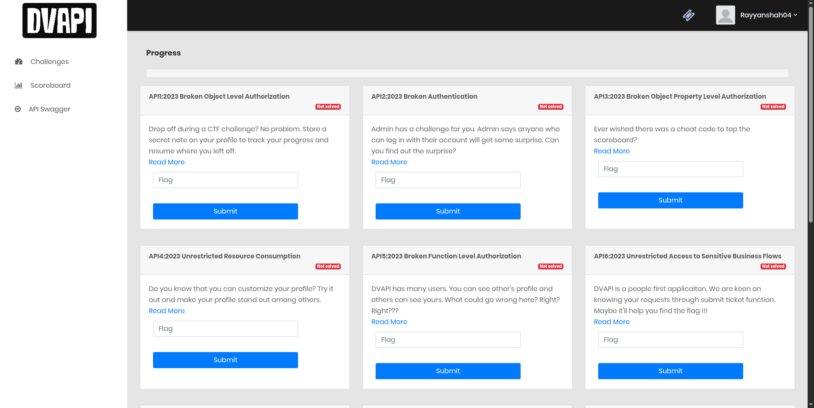

# DVAPI Vulnerability Assessment Report

| | |
|---|---|
| **Report Date** | April 14, 2026 |
| **Prepared By** | Syed Muhammad Rayyan |
| **Target Application** | DVAPI (Damn Vulnerable API) |
| **Target URL** | http://192.168.18.16:3000 |
| **Assessment Type** | Black-box API Penetration Test |
| **Classification** | Confidential |

---

## Table of Contents

1. [Executive Summary](#1-executive-summary)
2. [Scope & Methodology](#2-scope--methodology)
3. [Vulnerability Summary](#3-vulnerability-summary)
4. [Findings](#4-findings)
   - [FIND-01 — API8:2023 Security Misconfiguration](#find-01--api82023-security-misconfiguration)
   - [FIND-02 — API1:2023 Broken Object Level Authorization (BOLA)](#find-02--api12023-broken-object-level-authorization-bola)
   - [FIND-03 — API9:2023 Improper Inventory Management](#find-03--api92023-improper-inventory-management)
   - [FIND-04 — API3:2023 Broken Object Property Level Authorization](#find-04--api32023-broken-object-property-level-authorization)
   - [FIND-05 — API5:2023 Broken Function Level Authorization (BFLA)](#find-05--api52023-broken-function-level-authorization-bfla)
5. [Remediation Summary](#5-remediation-summary)

---

## 1. Executive Summary

A manual penetration test was conducted against DVAPI, a deliberately vulnerable API platform. Five distinct vulnerabilities were identified spanning the OWASP API Security Top 10 (2023). All findings were exploited successfully without brute force or automated scanning — through logic flaws and missing server-side controls alone.

The most critical finding (FIND-05) allowed any authenticated user to permanently delete other users' accounts via an unsecured HTTP method. FIND-02 and FIND-04 exposed private user data and allowed score manipulation through predictable parameter tampering. FIND-01 revealed a verbose error response leaking full server stack traces. FIND-03 exposed unreleased application content through hidden API parameters.

---

## 2. Scope & Methodology

**In Scope:** `http://192.168.18.16:3000` — all API endpoints reachable through the DVAPI web interface.

**Tools Used:** Burp Suite (Proxy, Repeater, JWT Editor extension), browser (Chrome).

**Methodology:** Manual testing. All requests were intercepted via Burp Proxy, analyzed, and replayed in Repeater with modified parameters to verify authorization flaws and misconfiguration.

---

## 3. Vulnerability Summary

| ID | Vulnerability | Endpoint | Severity | OWASP Category |
|---|---|---|---|---|
| FIND-01 | Security Misconfiguration — Stack Trace Disclosure | `POST /api/addNote` | High | API8:2023 |
| FIND-02 | Broken Object Level Authorization | `GET /api/getNote` | High | API1:2023 |
| FIND-03 | Improper Inventory Management | `POST /api/allChallenges` | Medium | API9:2023 |
| FIND-04 | Broken Object Property Level Authorization | `POST /api/register` | High | API3:2023 |
| FIND-05 | Broken Function Level Authorization | `DELETE /api/user/:username` | Critical | API5:2023 |

---

## 4. Findings

---

### FIND-01 — API8:2023 Security Misconfiguration

| | |
|---|---|
| **Severity** | High |
| **Endpoint** | `POST /api/addNote` |
| **Auth Required** | Yes (JWT) |
| **CVSS (approx.)** | 7.5 |

**Description**

The API returns full Node.js stack traces in error responses instead of generic error messages. This discloses internal file paths, module names, framework version, and application logic to any authenticated user who triggers a validation error.

**Steps to Reproduce**

1. Log in and navigate to the profile page. Add a note to capture the `POST /api/addNote` request in Burp.

   

2. Send the captured request to Repeater. The request carries a JWT in both the `Authorization` header and `auth` cookie.

   

3. Use the OPTIONS method to enumerate what HTTP methods the endpoint accepts.

   

4. Using the JWT Editor extension, decode the current token. Observe it contains `userId`, `username`, and `isAdmin: false` claims, signed with HS256.

   

5. Modify the JWT payload (e.g., change `isAdmin` to `true`) and re-send. The server rejects the tampered signature with HTTP 401 — but the response body leaks a **full stack trace** along with the flag, confirming verbose error output is enabled in production.

   

   ```
   Flag: flag{St4cK_tR4c3_eRR0R}
   ```

**Impact**

Attackers gain insight into server internals (file paths, library versions, code flow). This information is used to identify further attack vectors and aids in crafting targeted exploits.

**Remediation**

- Set `NODE_ENV=production` to suppress stack traces in Express.
- Implement a global error handler that returns only generic messages (`{"error": "Internal Server Error"}`).
- Never expose framework-level errors to API consumers.

---

### FIND-02 — API1:2023 Broken Object Level Authorization (BOLA)

| | |
|---|---|
| **Severity** | High |
| **Endpoint** | `GET /api/getNote?username=<target>` |
| **Auth Required** | Yes (JWT) |
| **CVSS (approx.)** | 8.1 |

**Description**

The note retrieval endpoint accepts a `username` query parameter to identify whose note to return. The server does not verify that the requesting user owns the requested resource. Any authenticated user can read any other user's private note by simply supplying a different username.

**Steps to Reproduce**

1. Navigate to the profile page. Intercept traffic in Burp. Identify the request fetching the current user's note: `GET /api/getNote?username=rayyanshah04`.

   

2. Change the `username` parameter to another known user (e.g., `test1`) while keeping the JWT unchanged.

   

3. Send in Repeater. The server responds `HTTP 200` and returns the target user's private note.

   

4. The stolen note content renders on the victim's profile page, confirming the data was returned by the server.

   

5. Repeat with `username=admin`. The admin's private note is returned, which contains the flag.

   

   ```
   Flag: flag{bola_l5_ev3rywh3r3}
   ```

**Impact**

Complete horizontal privilege escalation across all user accounts. Private notes of any user — including admin — are fully accessible to any authenticated attacker.

**Remediation**

- Derive the target user identity from the authenticated JWT on the server side, never from user-supplied input.
- Implement object-level authorization checks: `if (token.username !== requestedUsername) return 403`.
- Apply this pattern to all resource-fetching endpoints.

---

### FIND-03 — API9:2023 Improper Inventory Management

| | |
|---|---|
| **Severity** | Medium |
| **Endpoint** | `POST /api/allChallenges` |
| **Auth Required** | Yes (JWT) |
| **CVSS (approx.)** | 5.3 |

**Description**

The challenges endpoint uses a POST body parameter `released` to filter which challenges are returned. The server also accepts an undocumented parameter `unreleased` that returns challenges not yet published to users. This exposes hidden application content and internal data through an unretired/shadow API parameter.

**Steps to Reproduce**

1. Load the challenges page. Intercept in Burp and identify `POST /api/allChallenges` with body `{"released": 1}`.

   

2. Send to Repeater. Normal response returns 10 challenges as expected.

   

3. Rename the parameter from `released` to `unreleased` and send. The server returns 2 hidden challenges (Challenge11 and Challenge12), including a flag embedded in the `shortDescription` field.

   

   ```
   Flag: flag{a553Ts_m4N4g3m3NT_g0n3_wROhg}
   ```

**Impact**

Unauthorized access to unreleased features, challenges, and potentially internal API documentation or staging content. Leaks roadmap information and may expose incomplete or insecure features before they are hardened.

**Remediation**

- Remove or gate all unreleased/shadow parameters server-side. Never rely on obscurity.
- Maintain a versioned API inventory. Decommission or protect endpoints not intended for production use.
- Validate and whitelist accepted input parameters — reject unrecognized keys.

---

### FIND-04 — API3:2023 Broken Object Property Level Authorization

| | |
|---|---|
| **Severity** | High |
| **Endpoint** | `POST /api/register` |
| **Auth Required** | No |
| **CVSS (approx.)** | 7.5 |

**Description**

The user registration endpoint does not restrict which fields a client can supply. By adding a `score` property to the registration request body, an attacker can set an arbitrary score at account creation time. The server blindly persists the injected value into the database without stripping or validating extra properties (mass assignment).

**Steps to Reproduce**

1. Intercept the scoreboard request to understand the data model: `GET /api/scores` returns `username` and `score` per user.

   

2. Capture the normal `POST /api/register` request body: `{"username": "apkechaccha", "password": "apkechaccha"}`.

   

3. Add `"score": "9999"` to the body and resend. The server responds `HTTP 200 — Registration successful`, accepting the injected field.

   

4. Check `/api/scores`. The new account appears at the top of the scoreboard with score 9999.

   

5. Scrolling the scores response reveals the flag returned by the API.

   

   ```
   Flag: flag{brOk3n_oBj3cT_PrOp3rTy_L3v3L_AuthORiS4TiON}
   ```

**Impact**

Integrity of all scoreboard data is compromised. Any user can set an arbitrary score at registration, undermining application logic. The same pattern likely applies to other privileged fields (e.g., `isAdmin`, `role`) if they exist in the user schema.

**Remediation**

- Use an allowlist of accepted fields server-side. Explicitly define and validate the registration schema.
- Strip any unexpected properties before persisting to the database (avoid ORM mass assignment).
- Score should be computed server-side only, never accepted from client input.

---

### FIND-05 — API5:2023 Broken Function Level Authorization (BFLA)

| | |
|---|---|
| **Severity** | Critical |
| **Endpoint** | `DELETE /api/user/:username` |
| **Auth Required** | Yes (any valid JWT) |
| **CVSS (approx.)** | 9.1 |

**Description**

The user profile endpoint exposes a `DELETE` HTTP method that is not accessible through the application UI but is available and functional. Any authenticated user can permanently delete any other user's account by sending a `DELETE` request to `/api/user/<target_username>`. No admin role or ownership check is performed.

**Steps to Reproduce**

1. Navigate to a user's profile (e.g., `/user/Charlie`). Capture the request in Burp. Send an `OPTIONS` request to `/api/user/Charlie` to enumerate allowed methods.

   

   Response header: `Allow: GET, HEAD, DELETE`

2. Send `DELETE /api/user/Charlie` with a standard authenticated JWT (no elevated privileges). The server responds `HTTP 200` and confirms account deletion, returning the flag.

   

   ```
   Flag: flag{nO_fUncTiON_L3v3L_aUtH???}
   ```

**Impact**

Any authenticated user can permanently delete any account on the platform, including admin. This is a complete integrity failure — an attacker can destroy all user data or target specific accounts. No recovery mechanism was observed.

**Remediation**

- Restrict the `DELETE` method to admin roles only via server-side role checks on the route handler.
- Do not expose administrative HTTP methods on user-facing endpoints. Use separate admin API routes with strict access controls.
- Return `405 Method Not Allowed` for unauthorized methods rather than disclosing available methods via `Allow` headers to non-admin users.

---

## 5. Remediation Summary

| ID | Finding | Priority | Fix |
|---|---|---|---|
| FIND-05 | Broken Function Level Authorization | Critical | Role-based access control on DELETE routes |
| FIND-02 | Broken Object Level Authorization | High | Derive user identity from JWT server-side |
| FIND-04 | Broken Object Property Level Authorization | High | Allowlist fields in registration schema |
| FIND-01 | Security Misconfiguration (Stack Trace) | High | Disable verbose errors in production |
| FIND-03 | Improper Inventory Management | Medium | Validate and whitelist API parameters |

---

*This report was prepared for educational purposes against an intentionally vulnerable application (DVAPI). All findings are within authorized scope.*
